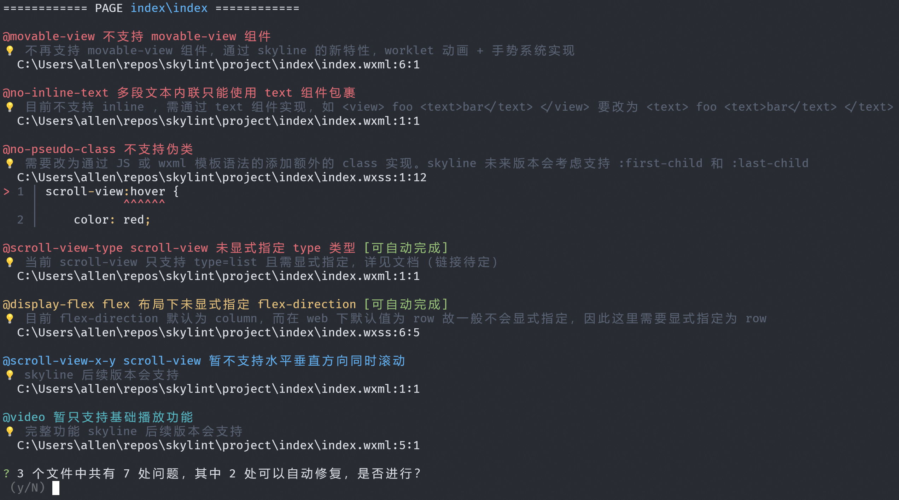

# Skylint：Skyline 小程序迁移工具

为帮助开发者迁移原有的 WebView 小程序到 Skyline，我们提供迁移工具 Skylint。Skylint 基于抽象语法树和一系列预设规则，分析小程序源代码中可能存在的兼容性和性能问题。

## 安装

使用任意 npm 包管理工具全局安装 Skylint ：

```shell
$ npm i -g skylint@latest
```

## 使用

**建议使用 Node 16 及以上版本。**

在需要迁移的工程根目录（即包含 `app.json` 的目录）执行：

```shell
$ skylint
```

随后跟随交互式指引配置 `app.json` 和要迁移的页面，Skylint 会逐个分析所选页面及其引用的模板和样式文件。


Skylint 会依照预设的一系列规则分析源代码，提示可能存在的兼容性和性能问题，并给出修改建议。对于部分规则，Skylint 提供可选的自动修复功能。



Skylint 所检查出的问题分为四个等级，分别是：

* [3] **Error**：明确有问题，需要修复，显示为红色；

* [2] **Warn**：大概率有问题，视具体情况而定，显示为黄色；

* [1] **Info**：可能有问题，也可能不影响适配，或不影响使用，显示为蓝色；

* [0] **Verbose**：不改也能正常运行，但强烈建议修改，显示为青色。

对于日志量较大的情况，Skylint 支持一组命令行参数，允许按日志等级、文件名和规则名过滤输出。例如：

```bash
# 仅显示 Warn 和 Error，并排除以 weui.wxss 为结尾的文件
$ skylint --log-level 2 --exclude "weui\.wxss$"

# 忽略 no-pseudo-class 和 no-pseudo-element 两条规则，注意需要完整规则名
$ skylint --ignore "no-pseudo-class, no-pseudo-element"

# 更多用法可以查看帮助
$ skylint -h
```

## 预设规则

下面列出了目前 Skylint 的预设规则，更多规则会陆续添加。

| 规则名                | 说明                                        | 日志等级 |
| --------------------- | ------------------------------------------- | -------- |
| disable-scroll        | 不支持页面全局滚动                          | Error    |
| flex-direction        | flex 布局下未显示指定 flex-direction        | Error    |
| form                  | 暂不支持 form 组件                          | Error    |
| icon                  | 不支持 icon 组件                            | Error    |
| inline-text           | 多段文本内联只能使用 text 组件包裹          | Error    |
| movable-view          | 不支持 movable-view 组件                    | Error    |
| no-native-nav         | 不支持原生导航栏                            | Error    |
| no-svg-style-tag      | svg 不支持 style 标签                       | Error    |
| picker-view           | 暂不支持 picker-view 组件                   | Error    |
| position-fixed        | 不支持 position: fixed                      | Error    |
| scroll-view-type      | scroll-view 未显示指定 type 类型            | Error    |
| switch                | 不支持 switch 组件                          | Error    |
| weui-extendedlib      | 暂不支持 weui 扩展库                        | Error    |
| box-sizing            | 存在不支持的 box-sizing 值                  | Warn     |
| navigator             | navigator 组件只能嵌套文本                  | Warn     |
| no-calc               | 不支持 calc 表达式                          | Warn     |
| no-css-animation      | 不支持 css animation                        | Warn     |
| no-pseudo-class       | 不支持伪类                                  | Warn     |
| no-pseudo-element     | 不支持伪元素                                | Warn     |
| scroll-view-not-found | 当前页面未使用 scroll-view 组件             | Warn     |
| text-overflow-ellipse | text-overflow: ellipse 只在 text 组件下生效 | Warn     |
| darkmode              | 暂不支持 darkmode                           | Info     |
| display-inline        | 不支持 display: inline                      | Info     |
| display-inline-block  | 不支持 display: inline-block                | Info     |
| scroll-view-margin    | scroll-view 组件的直接子节点 margin 无效    | Info     |
| scroll-view-x-y       | scroll-view 暂不支持水平垂直方向同时滚动    | Info     |
| ad                    | 暂不支持 ad 组件                            | Verbose  |
| mark-wx-for           | 未打开样式共享标记                          | Verbose  |
| scroll-view-optimize  | 未能充分利用 scroll-view 按需渲染的机制     | Verbose  |
| video                 | 暂只支持基础播放功能                        | Verbose  |

## 反馈

在使用中遇到问题，或对 Skylint 有功能改进的建议，欢迎在本仓库发表 issue。